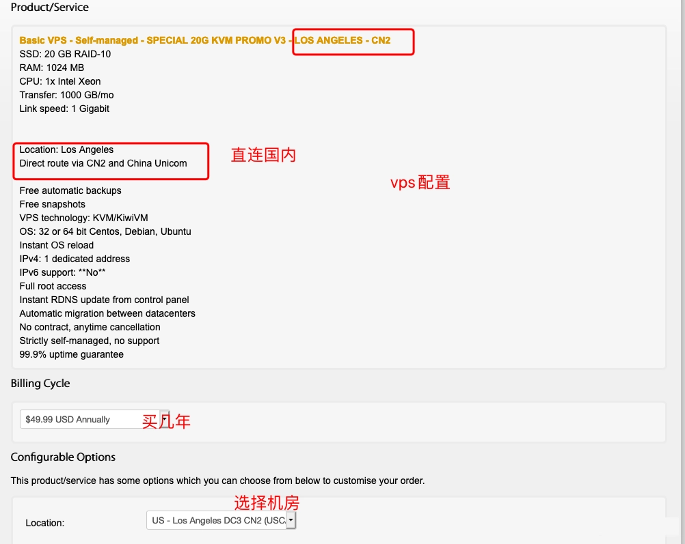
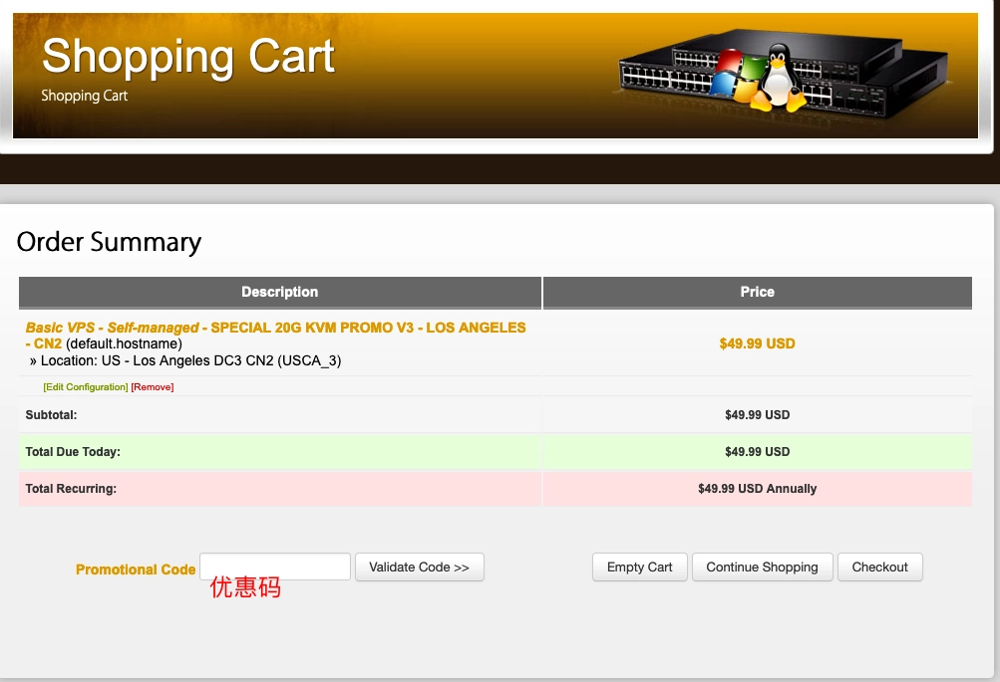
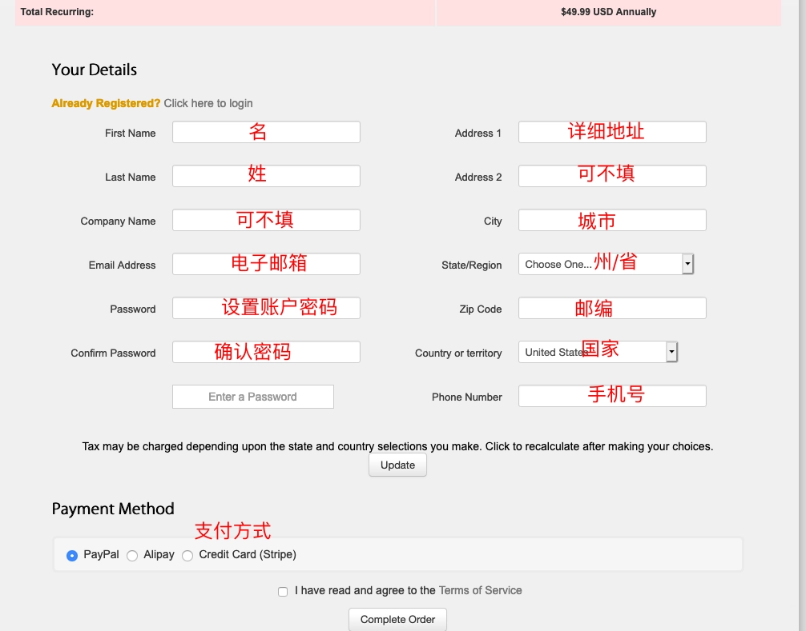
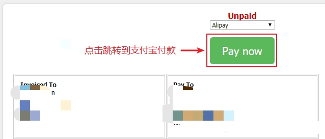
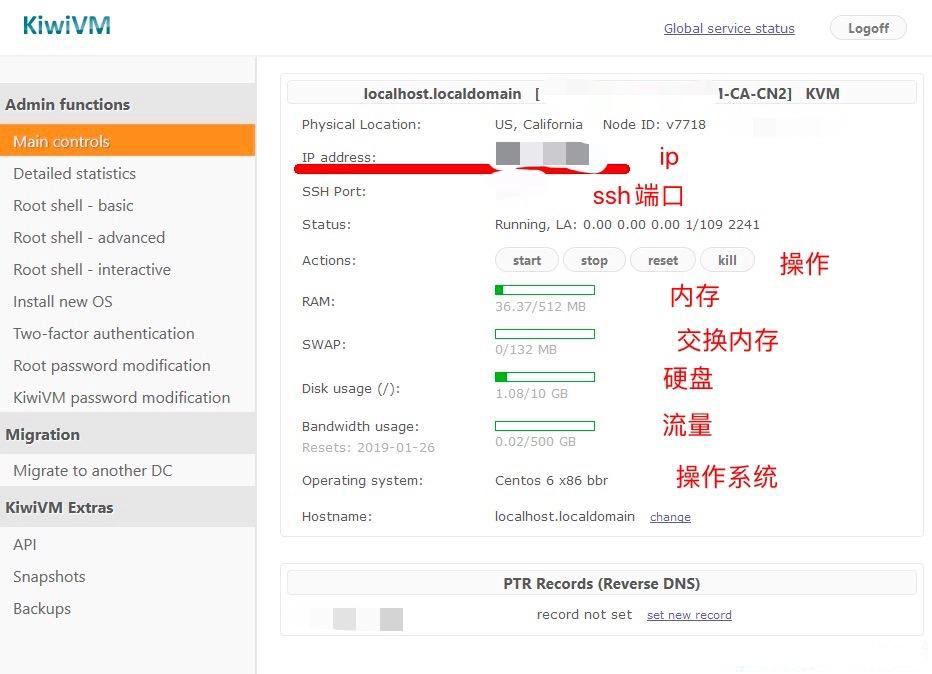
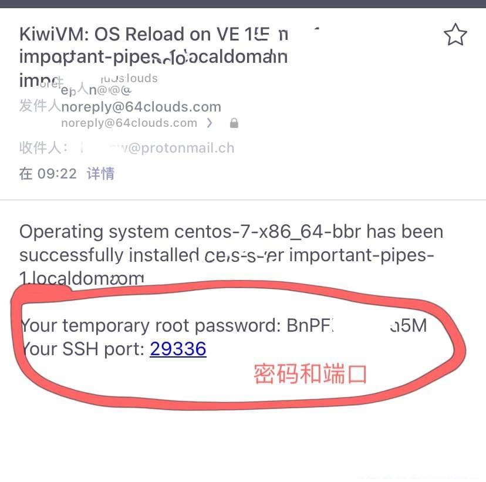
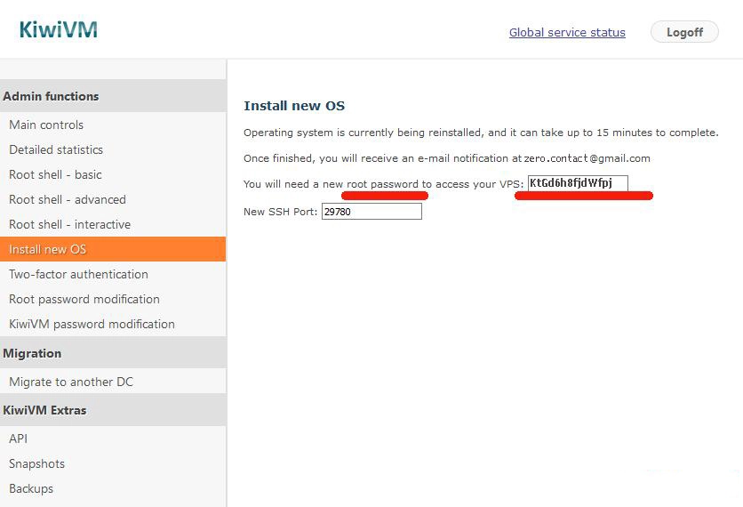
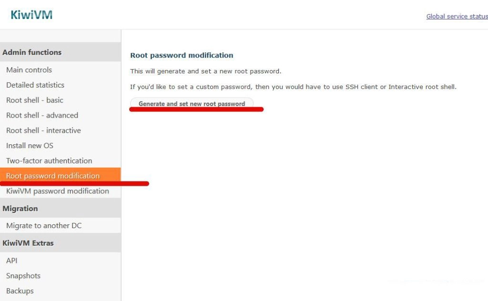
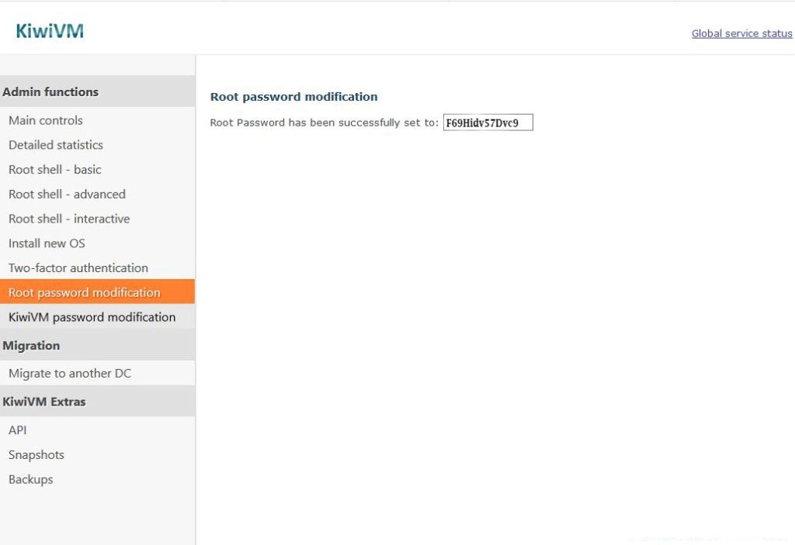

# 搬瓦工VPS购买和使用：从注册到连接服务器的完整指南

买个VPS其实没那么复杂，就像网购一样——选东西，填地址，付钱，收货。搬瓦工这家店开了很多年，卖的是美国的服务器，线路专门针对中国优化过，速度还行，价格也不算离谱。最关键的是有30天退款保证，买了不满意可以退，这点挺实在的。

不过有个小麻烦：因为太多人用它干那些"你懂的"事，官网经常被屏蔽，得换镜像地址才能访问。目前能直接打开的是 bwh89.net 这个域名。

---

## 怎么买搬瓦工VPS

搬瓦工的套餐多得眼花，速度排序大概是：香港 > CN2 GIA-E >= CN2 GIA > CN2 > 普通KVM。速度越快价格越贵，这个逻辑没毛病。香港VPS每月90美元起步，流量只有500G，适合不差钱的朋友。性价比高的套餐经常断货，比如那个49.99美元/年的CN2 GIA已经绝版了，成了"传家宝"。

如果你想要更稳定的线路和更灵活的配置，👉 [**现在查看搬瓦工最新套餐，找到最适合你的方案**](https://bandwagonhost.com/aff.php?aff=79616)。

选好套餐后进入详情页，可以选购买周期和机房：

确认服务器配置没问题，机房一般选默认的就行，点击"Add to Cart"加入购物车。接下来进入订单确认界面：

**注意：优惠码活动已经过期了，不用输入。** 确认无误后点"Checkout"，进入填写订单信息的页面：

按提示填个人信息。国家选China，州/省那一栏会变成输入框，用拼音输入省市就行。填完点"Update"。支付方式选"Alipay"（支付宝），勾选服务条款，点"Complete Order"进入付款界面。确认支付方式是Alipay，点绿色的"Pay now"按钮，用手机支付宝扫码付款。

## 买完之后怎么管理

付款成功后，在菜单栏选Services -> MyService（没登录的话先点右上角"Client Area"登录），就能看到刚买的VPS：

点右边的"KiwiVM Control Panel"，可以查看VPS详细信息：

搬瓦工会把SSH登录端口和密码发到你邮箱，记得去查收：

到这里，你已经有了VPS的IP、SSH端口和root密码。接下来就是连接服务器，运行脚本。

## 连接服务器和运行脚本

连接服务器是第二步，运行一键脚本是第三步。

常用的一键脚本有这几种：
- V2Ray一键脚本
- Xray一键脚本  
- trojan一键脚本
- trojan-go一键脚本

你可以任选一种（推荐v2ray/Xray/trojan），也可以在服务器上同时装多个，**但端口必须不同**。

装完脚本后，最后一步是下载和配置客户端。一键脚本教程里有电脑、手机的下载链接，照着做就行。

## 重装系统

如果你的系统不是CentOS 7/8、Ubuntu 16.04或Debian 8及以上版本，可以在后台重装操作系统：

1. 在VPS信息页面点"stop"按钮关机
2. 点左边菜单栏的"Install new OS"，选择"centos7-x86_64"
3. 勾选"I agree that all existing data on my VPS will be lost"
4. 点"Reload"开始重装

重装期间会显示root密码和新的SSH端口，**这个密码只会出现一次，务必记住**。

## 忘记密码怎么办

搬瓦工的root密码会发到邮箱，如果忘了可以在后台重置。操作步骤：

1. 确保VPS处于开机状态
2. 点左侧菜单的"root password modification"
3. 点"generate and set new password"重置密码

重置成功后会显示新密码，记得保存：

---

整个流程其实就是：选套餐→填信息→付款→收邮件→连接服务器→运行脚本→配置客户端。如果你需要一个稳定可靠、线路优化良好的VPS服务，👉 [**搬瓦工是个不错的选择**](https://bandwagonhost.com/aff.php?aff=79616)——30天退款保证让你可以放心试用,多年稳定运营也证明了它的可靠性。
